# Event-Driven Order Processing System on AWS


A serverless event-driven order processing system built on AWS using API Gateway, Lambda, Amazon RDS for MySQL, Secrets Manager, Amazon SNS, and Amazon SQS.

## 📌 Project Overview

This project demonstrates how to build a **serverless event-driven microservices application** on AWS. The application exposes a HTTP API through Amazon API Gateway, processes requests with AWS Lambda, securely retrieves database credentials from AWS Secrets Manager, stores order information in Amazon RDS MySQL, and publishes events to Amazon SNS. Multiple Amazon SQS queues subscribe to the SNS topic to simulate independent microservices processing the same event.

The architecture follows AWS best practices by using private networking, IAM roles, Secrets Manager, and asynchronous messaging services.

---

## 📑 Table of Contents

- [Project Overview](#-project-overview)
- [Features](#-features)
- [Architecture Diagram](#architecture-diagram)
- [Solution Architecture](#solution-architecture)
- [AWS Services Used](#aws-services-used)
- [Architecture Components](#architecture-components)
- [Network Architecture](#network-architecture)
- [Screenshots](#screenshots)
  - [1. Architecture Diagram](#1-architecture-diagram)
  - [2. Amazon VPC](#2-amazon-vpc)
  - [3. Amazon RDS Database](#3-amazon-rds-database)
  - [4. AWS Secrets Manager](#4-aws-secrets-manager)
  - [5. Lambda Function](#5-lambda-function)
  - [6. Lambda Environment Variables](#6-lambda-environment-variables)
  - [7. Lambda Layer](#7-lambda-layer)
  - [8. Amazon API Gateway](#8-amazon-api-gateway)
  - [9. Amazon SNS Topic](#9-amazon-sns-topic)
  - [10. Amazon SQS Queues](#10-amazon-sqs-queues)
  - [11. SNS Subscriptions](#11-sns-subscriptions)
  - [12. Successful Lambda Test](#12-successful-lambda-test)
  - [13. API Test from PowerShell](#13-api-test-from-powershell)
  - [14. Database Verification](#14-database-verification)
  - [15. SQS Message](#15-sqs-message)
- [Security Best Practices](#security-best-practices)
- [Outcome](#outcome)
- [Author](#author)
- [License](#license)

---

## 🚀 Features

- HTTP API built with Amazon API Gateway
- Serverless order processing using AWS Lambda
- Secure database credential management with AWS Secrets Manager
- Order storage in Amazon RDS for MySQL
- Event publication using Amazon SNS
- Fan-out messaging to multiple Amazon SQS queues
- Private networking with Amazon VPC
- Secure EC2 administration using AWS Systems Manager (Session Manager)

---

## Architecture Diagram

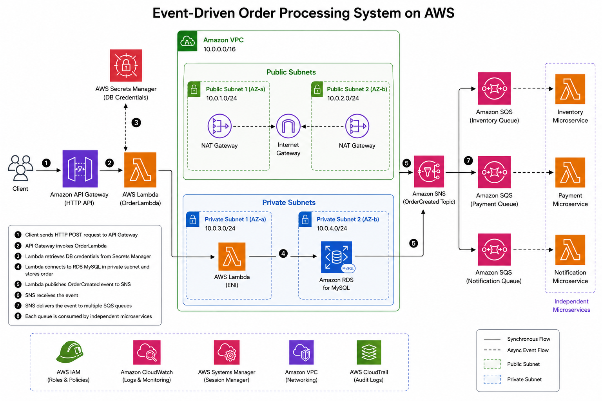

---

## Solution Architecture

1. A client sends an HTTP **POST** request to the API Gateway endpoint.
2. API Gateway invokes the **OrderLambda** function.
3. Lambda retrieves the database credentials securely from **AWS Secrets Manager**.
4. Lambda connects to **Amazon RDS MySQL** inside the VPC.
5. A new order is inserted into the **orders** table.
6. Lambda publishes an **OrderCreated** event to **Amazon SNS**.
7. Amazon SNS delivers the event to multiple subscribed Amazon SQS queues.
8. Each queue represents an independent microservice that can process the order asynchronously.

---

## AWS Services Used

- Amazon VPC
- Amazon EC2
- AWS Systems Manager (Session Manager)
- Amazon RDS for MySQL
- AWS Lambda
- AWS Lambda Layers
- Amazon API Gateway (HTTP API)
- AWS Secrets Manager
- Amazon SNS
- Amazon SQS
- AWS IAM
- Amazon CloudWatch

---

## Prerequisites

To deploy this project, you should have:

- An AWS account
- Basic knowledge of AWS services
- IAM permissions to create VPC, Lambda, API Gateway, RDS, SNS, SQS, and Secrets Manager resources
- Python 3.14
- AWS CLI (optional, for testing and administration)

---

## Architecture Components

| Service | Purpose |
|----------|---------|
| Amazon API Gateway | Exposes the HTTP API endpoint |
| AWS Lambda | Processes incoming orders |
| AWS Secrets Manager | Securely stores database credentials |
| Amazon RDS MySQL | Stores order information |
| Amazon SNS | Publishes OrderCreated events |
| Amazon SQS | Receives events from SNS |
| Amazon EC2 | Database administration host |
| IAM | Provides secure permissions |
| VPC | Secure network isolation |

---

## Network Architecture

The infrastructure is deployed inside a custom Amazon VPC.

- Public Subnet
  - NAT Gateway
- Private Subnet
  - EC2 Instance
  - Lambda Function
  - Amazon RDS

This design keeps the database private while still allowing Lambda and EC2 to access it securely.

---

## Screenshots

### 1. Amazon VPC

Custom VPC with public and private subnets.

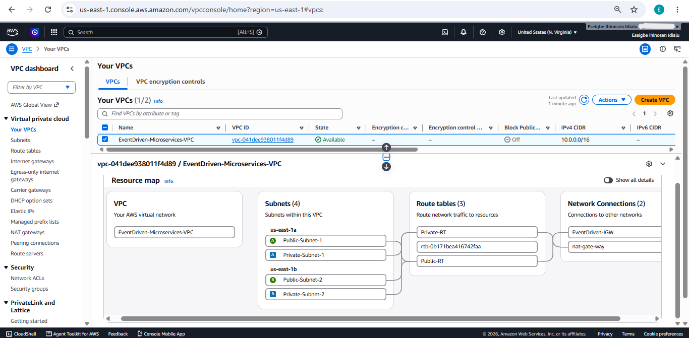

---

### 2. Amazon RDS Database

Amazon RDS MySQL instance used to store orders.

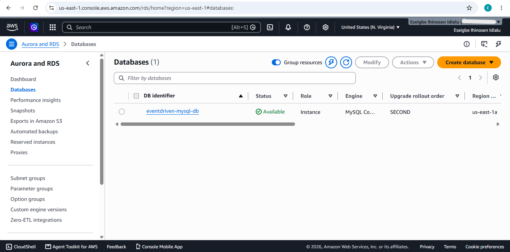

---

### 3. AWS Secrets Manager

Database credentials are stored securely inside Secrets Manager instead of being hardcoded.

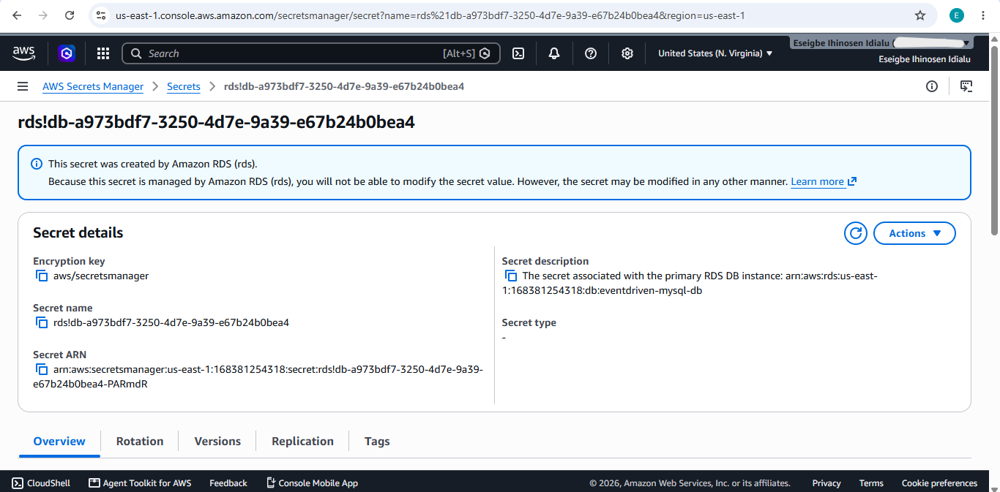

---

### 4. Lambda Function

The OrderLambda function processes incoming API requests.

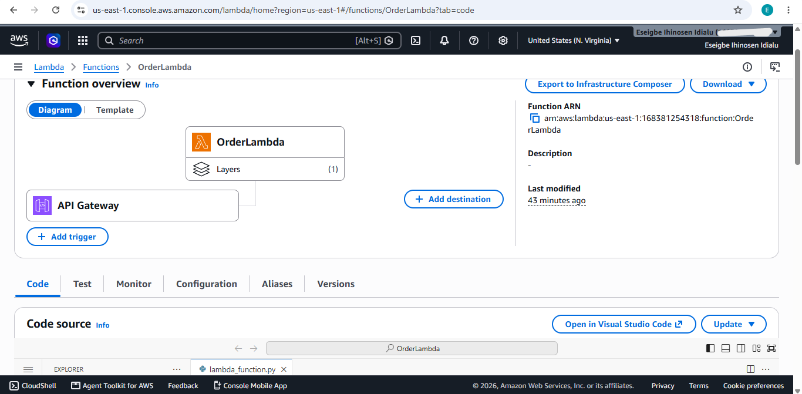

---

### 5. Lambda Environment Variables

The Lambda function uses environment variables to store configuration such as:

- DB_HOST
- DB_NAME
- SECRET_NAME
- SNS_TOPIC_ARN

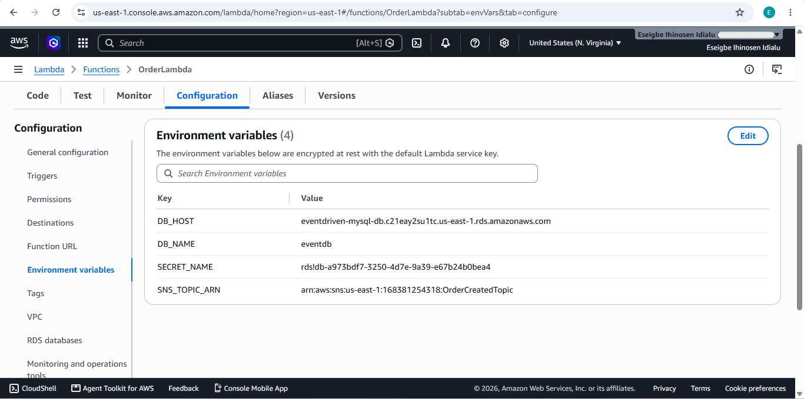

---

### 6. Lambda Layer

PyMySQL is packaged as a Lambda Layer to keep the deployment package lightweight.

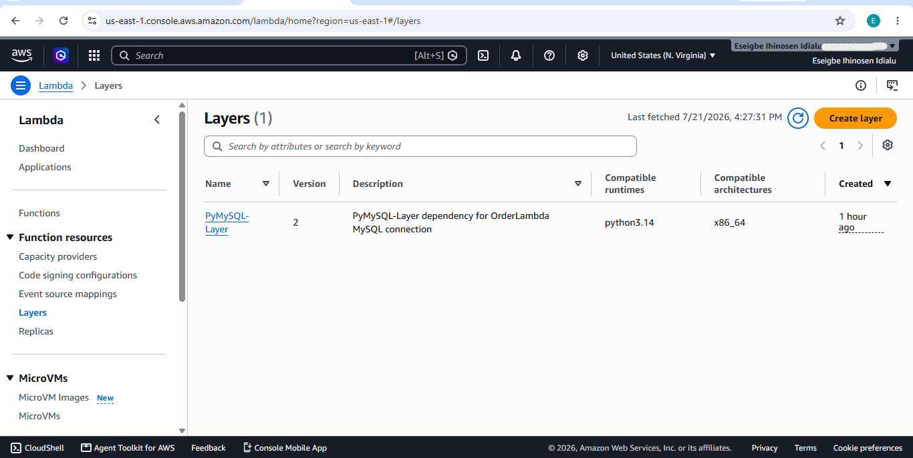

---

### 7. Amazon API Gateway

Amazon API Gateway exposes the application's REST API to external clients. The API is deployed using the **$default** stage and provides a public HTTPS endpoint that clients can use to submit new orders.

#### API Overview

The API overview shows the deployed HTTP API, the invoke URL, and the default stage used to access the application.

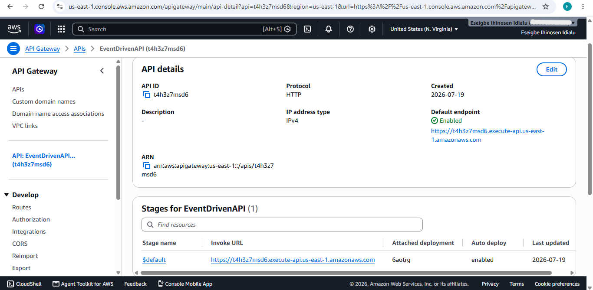

#### API Route

The API exposes the following endpoint:

```http
POST /orders
```

This endpoint accepts a JSON payload containing the customer name, product name, and quantity. API Gateway forwards the request to the **OrderLambda** function, which stores the order in Amazon RDS and publishes an **OrderCreated** event to Amazon SNS.

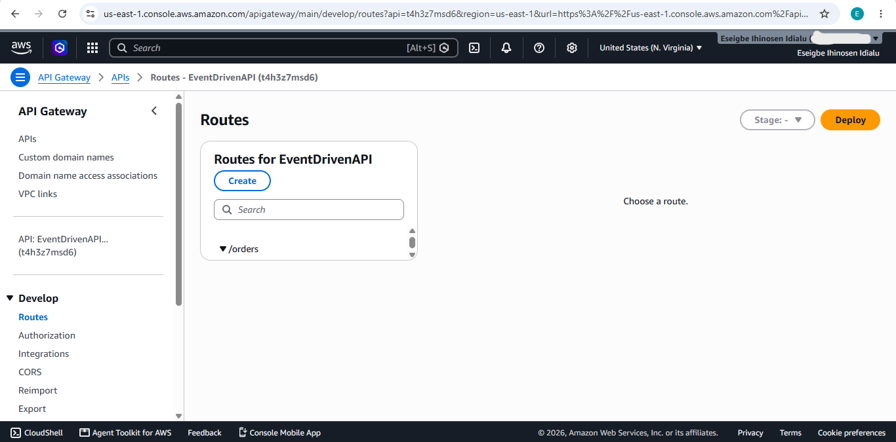

---

### 8. Amazon SNS Topic

SNS publishes OrderCreated events.

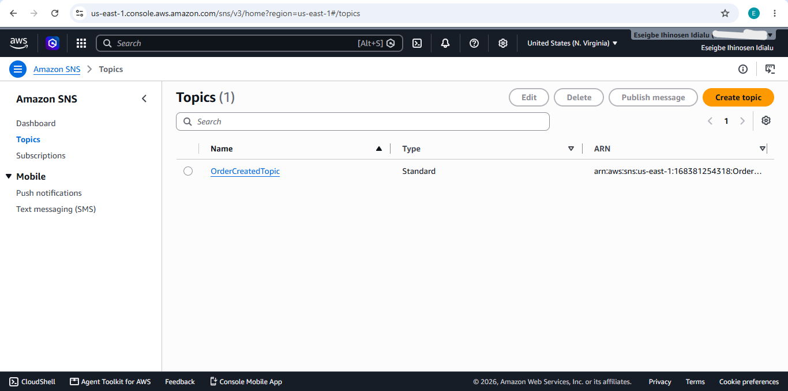

---

### 9. Amazon SQS Queues

Multiple queues subscribe to the SNS topic.

Example queues:

- Inventory Queue
- Payment Queue
- Notification Queue

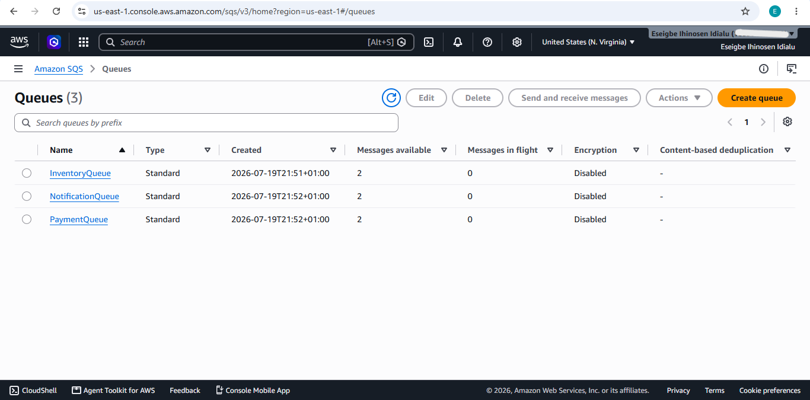

---

### 10. SNS Subscriptions

Shows the SNS topic successfully connected to all SQS queues.

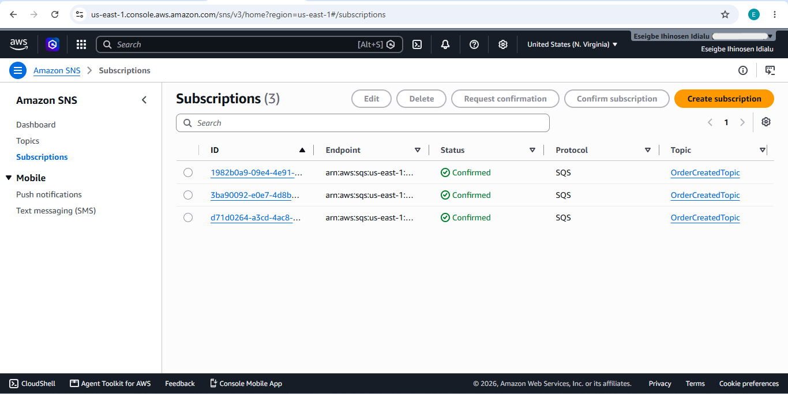

---

### 11. Successful Lambda Test

Lambda successfully inserts an order into Amazon RDS and publishes an event.

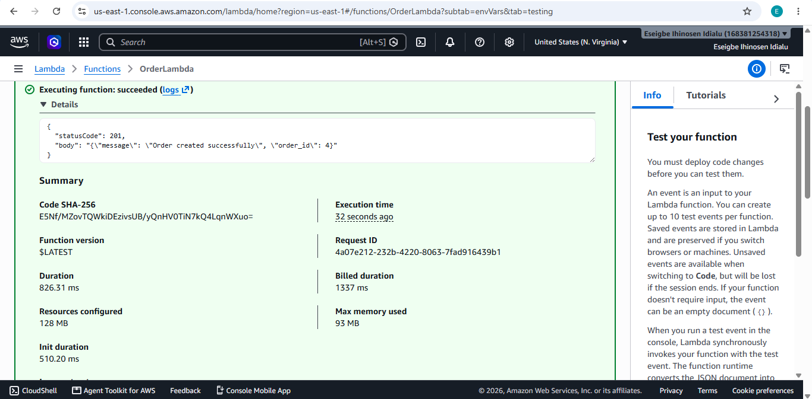

---

### 12. API Test from PowerShell

The API is tested using PowerShell.

Example:

```powershell
$body = @{
    customer_name = "Alice"
    product_name = "Keyboard"
    quantity = 2
} | ConvertTo-Json

Invoke-RestMethod `
    -Method POST `
    -Uri "https://t4h3z7msd6.execute-api.us-east-1.amazonaws.com/orders" `
    -ContentType "application/json" `
    -Body $body
```

Successful response:

```
Order created successfully
order_id: 3
```

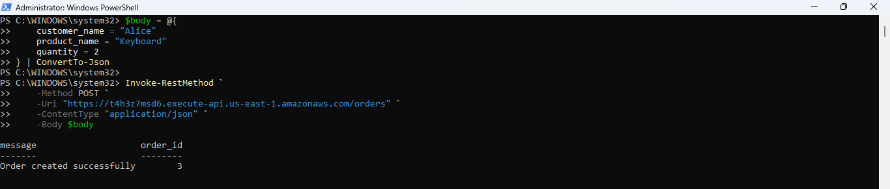

---

### 13. Database Verification

The order is successfully stored inside Amazon RDS.

```sql
SELECT * FROM orders;
```

Example:

| order_id | customer_name | product_name | quantity |
|----------|---------------|--------------|----------|
| 1 | John Doe | Laptop | 1 |
| 2 | John Doe | Laptop | 1 |
| 3 | Alice | Keyboard | 2 |

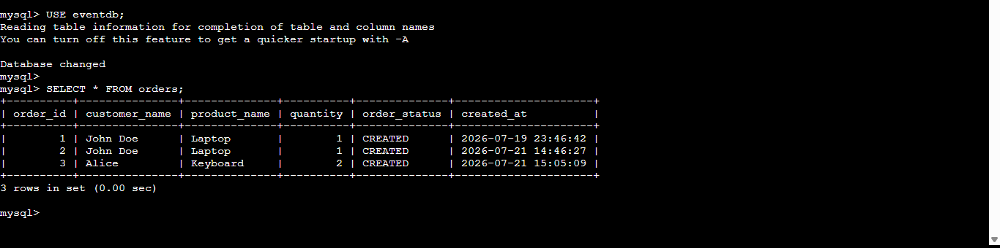

---

### 14. SQS Message

After Lambda publishes the event to SNS, the subscribed SQS queue receives the message.

Example message:

```json
{
  "order_id": 3,
  "customer_name": "Alice",
  "product_name": "Keyboard",
  "quantity": 2,
  "status": "CREATED"
}
```

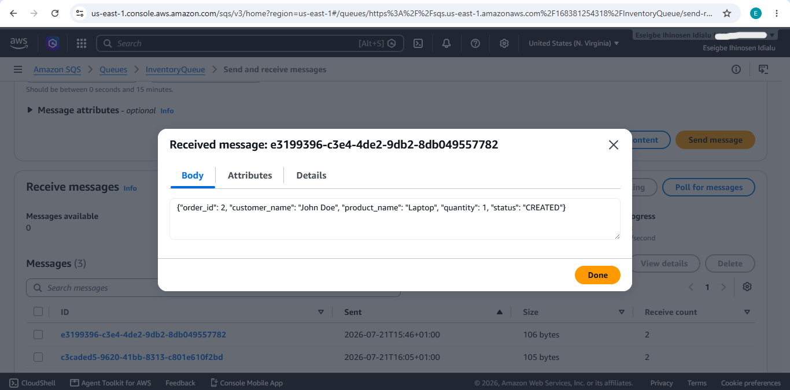

---

## Security Best Practices

- IAM Roles used instead of access keys.
- Database credentials stored in AWS Secrets Manager.
- Amazon RDS deployed in private subnets.
- Lambda connects to RDS using VPC networking.
- EC2 managed securely using AWS Systems Manager (Session Manager) instead of SSH.

---

## Outcome

This project demonstrates how to design, deploy, and test a secure event-driven application on AWS using managed cloud services. It showcases serverless computing, secure credential management, private networking, asynchronous messaging, and HTTP API development while following AWS best practices.

---

## Author

**Eseigbe Ihinosen**

Aspiring Cloud & Cybersecurity Engineer

- AWS Cloud
- Python
- Serverless Computing
- Event-Driven Architecture
- Amazon RDS
- API Gateway
- AWS Lambda
- SNS
- SQS

---

## License

This project is licensed under the MIT License.